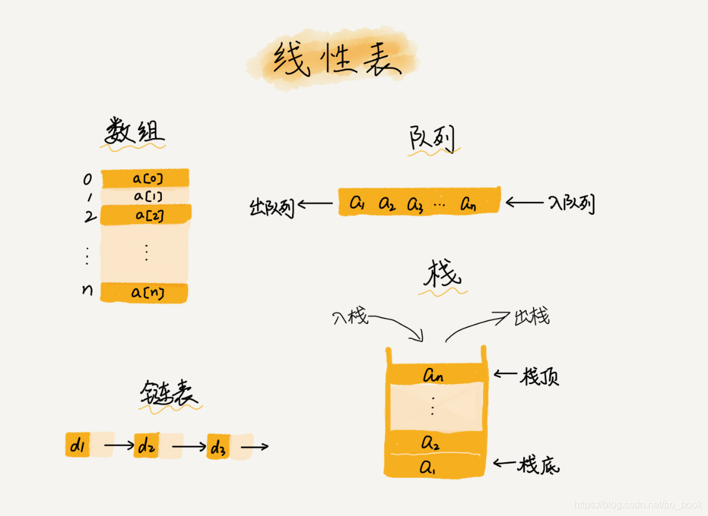
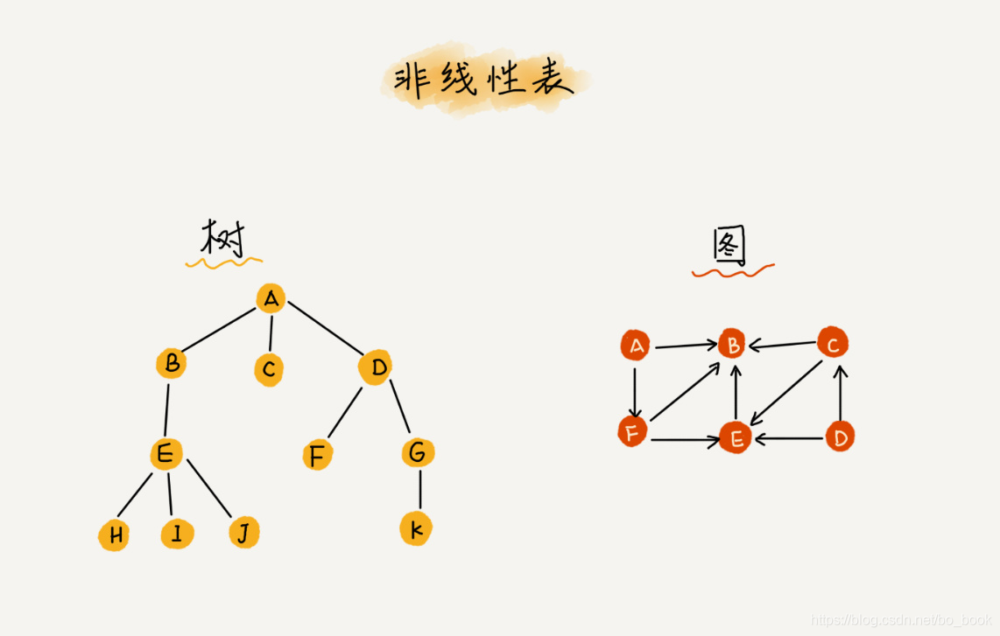

# 数据结构的类型

## 线性表 Linear List

> 顾名思义，线性表就是数据排成像一条线一样的结构。每个线性表上的数据最多只有前和后两个方向。其实除了数组，链表、队列、栈等也是线性表结构。

- [数组](./foundation/array.md)
- [链表]()
- [队列]()
- [栈]()

## 非线性表 Non-Linear List

> 比如二叉树、堆、图等。之所以叫非线性，是因为，在非线性表中，数据之间并不是简单的前后关系,往往具有多前或者多后。

