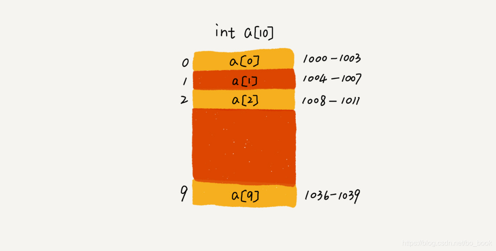

# 数组

## 1. 定义

> 数组（Array）是一种线性表数据结构。它用一组连续的内存空间，来存储一组具有相同类型的数据。


### 1.1 线性表结构参考 - [数据结构基础分类](./../CLASSIFY.md)

### 1.2 连续的内存空间和相同类型的数据

正是因为这两个限制，它才有了一个堪称“杀手锏”的特性：“随机访问”。但有利就有弊，这两个限制也让数组的很多操作变得非常低效，比如要想在数组中删除、插入一个数据，为了保证连续性，就需要做大量的数据搬移工作。

说到数据的访问，那你知道数组是如何实现根据下标随机访问数组元素的吗？

我们拿一个长度为 10 的 int 类型的数组 int[] a = new int[10]来举例。在我画的这个图中，计算机给数组 a[10]，分配了一块连续内存空间 1000～1039，其中，内存块的首地址为 base_address = 1000。



我们知道，计算机会给每个内存单元分配一个地址，计算机通过地址来访问内存中的数据。当计算机需要随机访问数组中的某个元素时，它会首先通过下面的寻址公式，计算出该元素存储的内存地址：
```c
a[i]_address = base_address + i * data_type_size
```
其中 data_type_size 表示数组中每个元素的大小。我们举的这个例子里，数组中存储的是 int 类型数据，所以 data_type_size 就为 4 个字节。这个公式非常简单。

注意：**数组支持随机访问，根据下标随机访问的时间复杂度为 O(1)，并不代表数组查找快**

所以以上内容，我们不难看出，数组的下标为何设计为从0开始。因为如果符合人类阅读习惯，下标从1开始，那么第n个索引位置的元素地址将会变为`base_address + (n-1) * data_type_size`，这个运算会比以0开始编号的索引计算多一次减法运算，这对于基础数据结构的数组来说是非常消耗CPU计算的。

## 2. 数据容器

个人理解，数据容器最大的优势就是可以将很多操作的封装起来。比如插入、删除数据时需要搬移数据操作等。另外更大的封装，就是动态扩容。

当我们自己使用数组时，初始化数组大小之后，每次数据量增加，我们都需要将原来的数组进行复制并放入新的更大的数组中，而使用容器，这鞋操作都帮我们封装好，只需要将新的数据通过调用API往容器中添加即可。每次扩容，例如ArrayList都会帮我们自动扩容1.5倍大小。

不过，如果事先能确定需要存储的数据大小，最好在创建 ArrayList 的时候事先指定数据大小，因为扩容搬移数据时必然会有性能消耗的。
